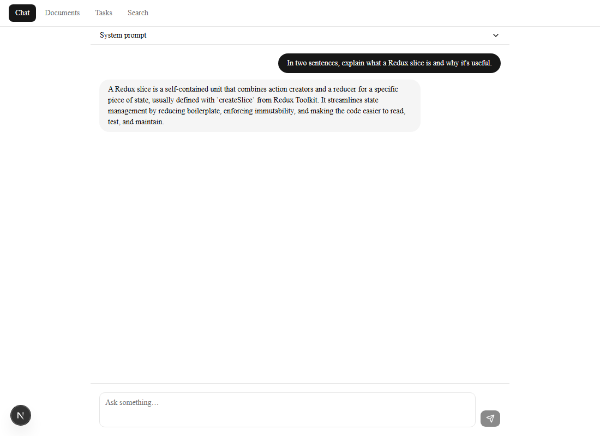
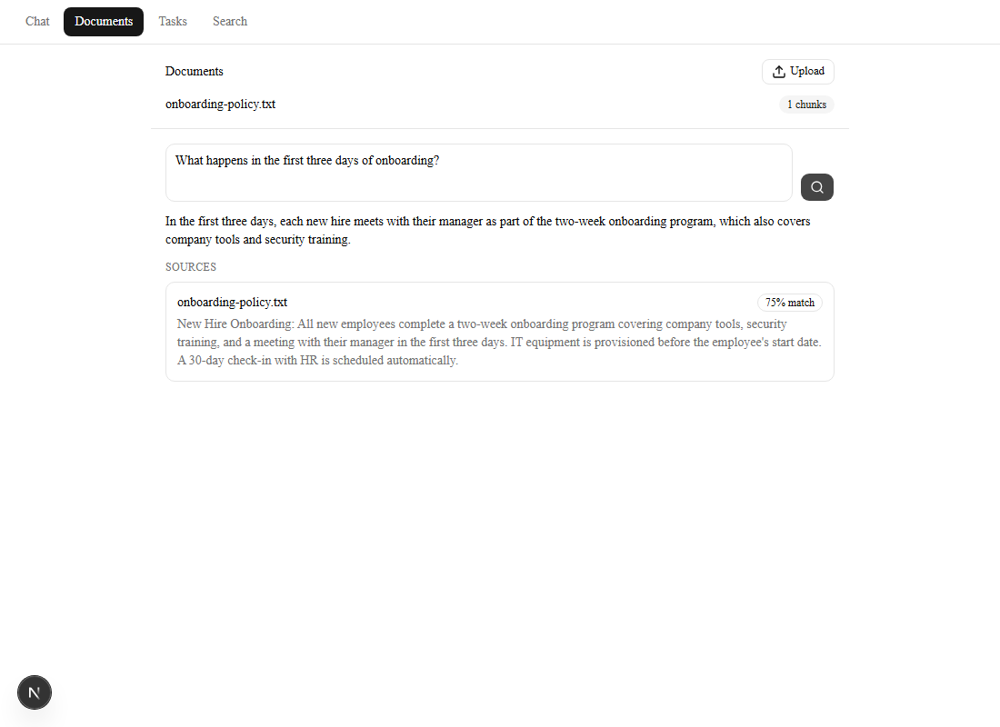
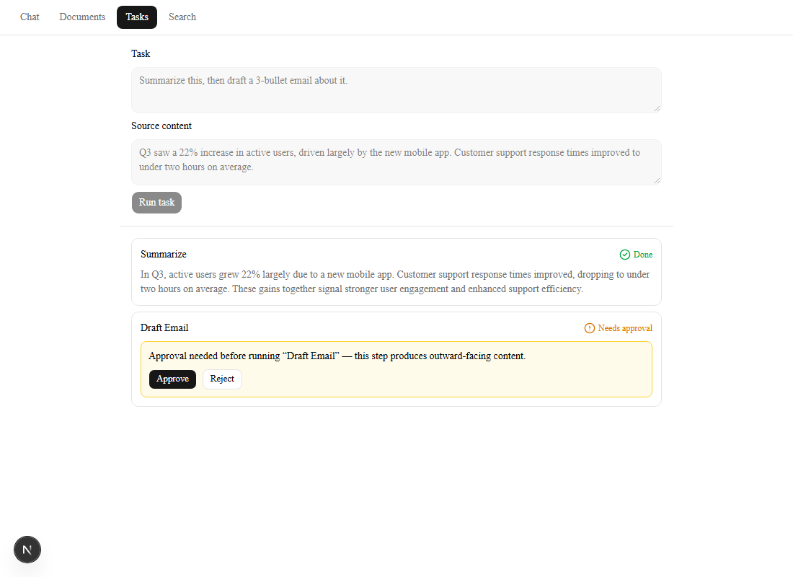
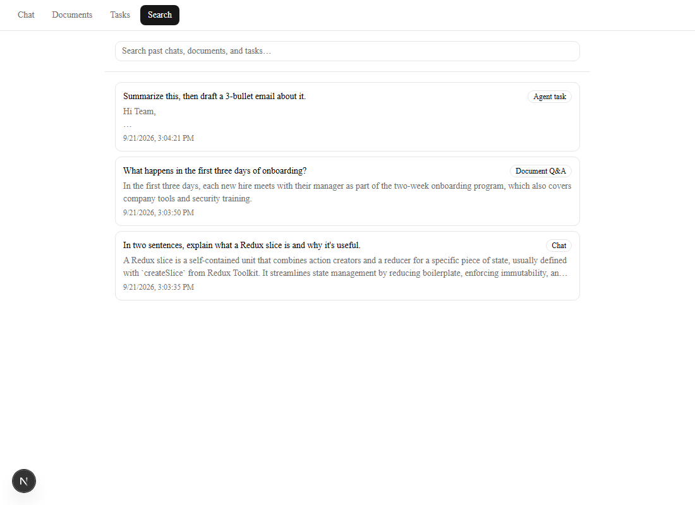

# AI Task Assistant

A Next.js + Redux Toolkit app with four features built around LLM calls: streaming
chat, document Q&A (upload, chunk, embed, retrieve, answer with cited sources), a
multi-step agent task runner with human-in-the-loop approval checkpoints, and a
searchable history across all three.

| | |
|---|---|
|  |  |
| Streaming chat | Document Q&A with cited sources |
|  |  |
| Agent task mid-run, paused on its approval checkpoint | Search across all three |

## APIs used

No API used here has a free tier for real OpenAI access, so the app is built to be
provider-agnostic and is currently configured against two free services:

- **Chat completions + agent task planning/execution** — the [`openai`](https://www.npmjs.com/package/openai)
  SDK, but pointed at [Groq](https://console.groq.com)'s OpenAI-compatible endpoint
  (`OPENAI_BASE_URL=https://api.groq.com/openai/v1`) instead of `api.openai.com`, with
  model `openai/gpt-oss-20b`. Groq has a genuine free tier (no card required). Swapping
  back to real OpenAI, or any other OpenAI-compatible provider, is a two-env-var change
  — see `lib/ai/client.ts` and `lib/ai/chat.ts`. Structured output (the agent task
  planner) uses the SDK's JSON mode, validated with Zod.
- **Embeddings for document Q&A** — [Google Gemini's embeddings API](https://ai.google.dev/gemini-api/docs/embeddings)
  (`gemini-embedding-001`), called directly via `fetch` in `lib/ai/embeddings.ts`, not
  through the OpenAI SDK. Groq doesn't host an embeddings endpoint, so this is a second,
  independent free API. Key from [Google AI Studio](https://aistudio.google.com/apikey),
  also free, no card required.
- **PDF text extraction** — [`unpdf`](https://www.npmjs.com/package/unpdf) (no API,
  runs locally).

## Tech stack

- **Next.js** (App Router) + **TypeScript** (strict mode)
- **Tailwind CSS** + **shadcn/ui** (Radix primitives)
- **Redux Toolkit** + RTK Query for state and data fetching
- **OpenAI SDK**, called only from Next.js Route Handlers — never exposed client-side
- **Zod** for runtime validation of all LLM structured outputs and env vars
- **Vitest** + React Testing Library (unit), **Playwright** (e2e), **Storybook** (components)

## Getting started

```bash
npm install
cp .env.local.example .env.local
```

Fill in `.env.local`:

```
OPENAI_API_KEY=your key
OPENAI_BASE_URL=https://api.groq.com/openai/v1   # optional — omit to use real OpenAI
OPENAI_MODEL=openai/gpt-oss-20b                    # optional — defaults to gpt-4o-mini
GEMINI_API_KEY=your key                            # required for document Q&A
```

```bash
npm run dev
```

Open [http://localhost:3000](http://localhost:3000).

Other scripts:

```bash
npm run typecheck       # tsc --noEmit
npm run lint             # eslint
npm run test              # vitest unit project (jsdom + React Testing Library)
npm run test:e2e         # playwright
npm run storybook        # component explorer on :6006
npm run build             # production build
```

## Architecture

```
app/                     Routing only (App Router pages, layouts, route handlers)
components/ui/           shadcn/ui primitives (generated, not hand-edited)
components/app-nav.tsx   Top-level nav between features
features/
  chat/                  components/ hooks/ api/ types/
  documents/              components/ hooks/ api/ types/
  agent-tasks/             components/ hooks/ api/ types/
  search/                   components/ hooks/ api/ types/ — client-only, no route handlers
lib/
  ai/                     Single service layer wrapping all LLM calls
                           (chat.ts, embeddings.ts, agentTasks.ts, client.ts) — no
                           direct SDK or fetch-to-LLM calls from components or routes
  documents/               Server-side document processing: chunking, PDF/text
                           extraction, and an in-memory vector store
  api/errors.ts            Shared RTK Query error-message helper
  redux/                   Store assembly (store.ts, hooks.ts, provider.tsx).
                           Feature state lives in each feature's own slice, not a
                           global god-state.
  env.ts                   Zod-validated environment variables, read per-feature via
                           requireEnv() so a missing key for one integration (e.g.
                           embeddings) can't break an unrelated one (e.g. chat)
e2e/                       Playwright specs
```

**Rules that shape this layout:**

- Every LLM call goes through `lib/ai` — components and route handlers never import
  the OpenAI SDK, or call an LLM's REST API directly.
- Data-fetching and orchestration logic lives in custom hooks (`useChatStream`,
  `useDocumentQA`, `useAgentTask`, `useHistorySearch`, …) inside each feature's
  `hooks/` folder — components stay presentational.
- API contracts are typed end-to-end: a Zod schema is the source of truth, and the
  TypeScript type is inferred from it, shared between client and server.
- State is feature-scoped (Redux slices per feature), assembled by `lib/redux/store.ts`.

## Feature notes

- **Chat** streams token-by-token over a `ReadableStream` from a Route Handler — no
  Vercel AI SDK, just the Web Streams API on the server and `response.body.getReader()`
  on the client.
- **Document Q&A** chunks the uploaded file, embeds each chunk, and stores
  chunk+vector pairs in an in-memory, process-scoped store (`lib/documents/store.ts`).
  This is a deliberate simplification for a `next dev` / demo context: it resets on
  server restart and wouldn't survive across serverless instances in a real
  deployment — a production version would swap it for a persistent vector store
  without touching any other layer. Every answer shows the source snippet(s) it was
  grounded in, with a similarity score.
- **Agent task runner** plans a goal into steps via the LLM's JSON mode (validated
  with Zod), then executes them in order: `pending → running → done/failed`. A step
  kind that's side-effecting (drafting outward-facing content) always requires an
  explicit approve/reject checkpoint before it runs — this is a fixed mapping, not
  left to the planner's judgment. A failed step can be retried in place; the chain
  continues from wherever it left off.
- **Search** has no backend: completed chat replies, document answers, and agent
  tasks are logged to a Redux slice and persisted to `localStorage`, then filtered
  client-side. Failed, rejected, or still-in-progress runs are intentionally not
  logged.

## Testing

- Unit tests (`*.test.ts(x)`) live next to the code they test and run under jsdom via
  `npm run test` — slices, hooks (with network calls mocked), and pure logic like
  chunking and cosine-similarity ranking.
- Component stories live next to their components (`ChatMessageBubble`, `TaskStep`,
  `ApprovalCheckpoint`) and double as Storybook's browser-mode test project.
- Every feature has also been verified by hand against a live `next dev` server with
  real API calls — not just typechecked/linted/built.

## Known limitations

- The document store is in-memory (see above) — not durable, not multi-instance.
- No formal Playwright e2e spec yet (`e2e/` is scaffolded but empty) — coverage so
  far has been manual, against a live dev server.
- General chat replies can occasionally contain literal `**markdown**` syntax, since
  only the document Q&A and agent task prompts were told to avoid it.
